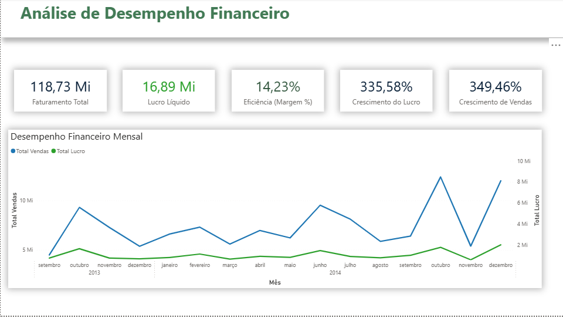
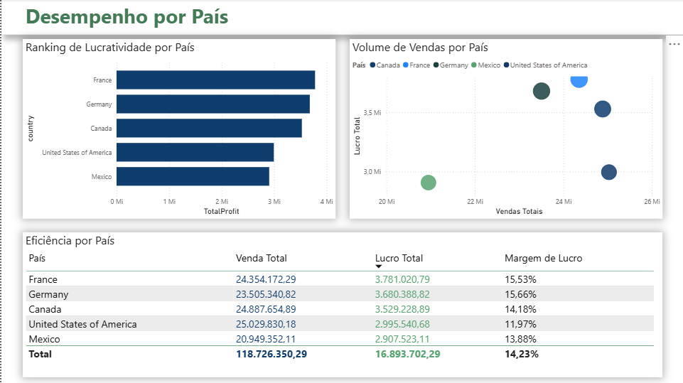
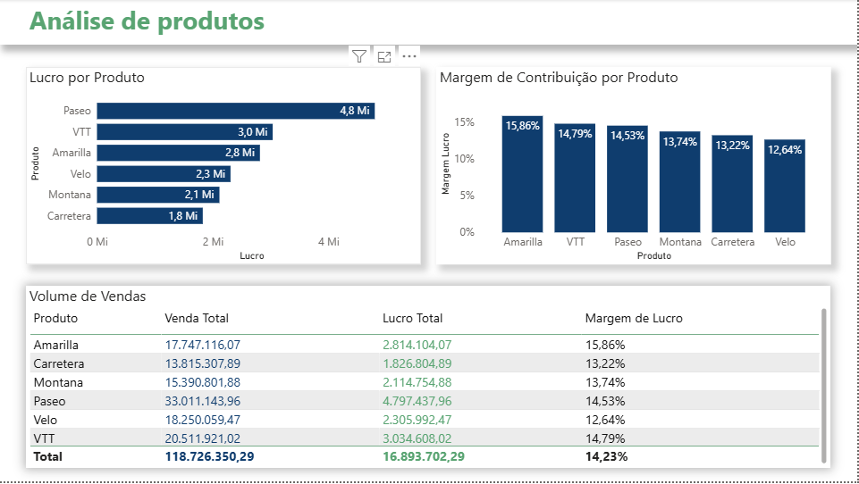
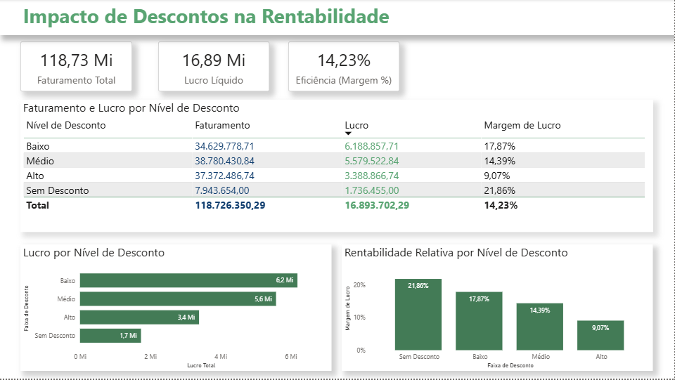
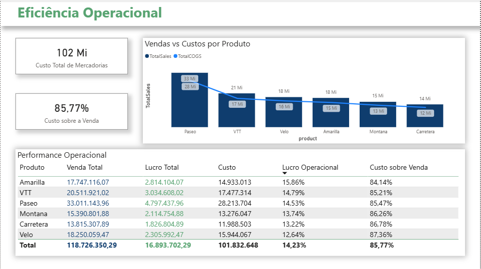

# 📊💰 Análise Financeira e Comercial — BI, SQL Server e Tomada de Decisão

## 👀 Visão Geral do Projeto

Este projeto apresenta uma **análise financeira e comercial completa**, simulando um cenário corporativo real de **Business Intelligence**, no qual dados são transformados em **informações confiáveis para suporte à tomada de decisão estratégica**.

A análise é baseada em um dataset que representa vendas de uma empresa multinacional, com operações em diferentes **países, produtos, segmentos de clientes e políticas de desconto**.

O foco do projeto está em:
- Estruturar dados com qualidade
- Consolidar métricas financeiras confiáveis
- Analisar desempenho, rentabilidade e eficiência
- Comunicar insights de forma clara para gestores

📌 Dataset original disponível no Kaggle:  
[*Financial Sample*](https://www.kaggle.com/datasets/nickolashirata/financial-sample)

---

## 🎯 Objetivo do Projeto

Demonstrar, de forma prática, como **dados financeiros brutos podem ser organizados, analisados e transformados em insights acionáveis**, apoiando decisões relacionadas a:

- Rentabilidade e margens
- Crescimento sustentável
- Eficiência operacional
- Estratégias de desconto
- Performance por país, produto e segmento

O projeto segue uma separação clara entre:
- **Preparação dos dados (Python)**
- **Cálculo oficial de métricas e regras de negócio (SQL Server)**
- **Análise visual e storytelling (Power BI)**

---

## 🧠 Problema de Negócio

Em um cenário de empresa multinacional, a gestão precisa responder perguntas como:

### 📈 Desempenho Financeiro
- O negócio é lucrativo?
- O crescimento de vendas acompanha o crescimento do lucro?
- As margens permanecem saudáveis ao longo do tempo?

### 🌍 Performance por País
- Quais países geram mais lucro?
- Onde há alto volume de vendas, mas baixa eficiência?
- Quais mercados são mais estratégicos financeiramente?

### 📦 Produtos
- Quais produtos concentram vendas e lucro?
- Existem produtos com margens abaixo da média?
- Onde o custo impacta diretamente a rentabilidade?

### 💸 Descontos
- Descontos aumentam vendas, lucro ou apenas volume?
- Quais faixas de desconto são sustentáveis?
- Onde a margem está sendo corroída?

### ⚙️ Eficiência Operacional
- Qual a relação entre os custos de mercadoria e as vendas?
- Quais produtos operam com maior eficiência?
- Onde existem oportunidades de otimização de custos?

---

## 🛠️ Etapas do Projeto

### 1️⃣ Preparação e Qualidade dos Dados (Python)

Os dados foram tratados para garantir **consistência, padronização e confiabilidade**, sem aplicação de regras de negócio.

Principais ações:
- Padronização de colunas (`snake_case`)
- Conversão correta de tipos de dados
- Tratamento de categorias
- Remoção de inconsistências
- Preservação dos valores financeiros originais

📌 Nenhuma métrica financeira é calculada nesta etapa.

---

### 2️⃣ SQL Server — Camada Analítica e Regras de Negócio

O **SQL Server atua como fonte oficial da verdade**, simulando um ambiente corporativo de BI.

Nesta camada:
- Métricas financeiras são recalculadas
- Regras de negócio são aplicadas explicitamente
- Análises são documentadas e reutilizáveis
- Dados ficam prontos para consumo em BI

Principais análises:
- Vendas, lucro, custos e margens
- Análises temporais (YoY)
- Rankings por país e produto
- Impacto de descontos
- Eficiência operacional

Técnicas utilizadas:
- CTEs
- Window Functions (`LAG`, `OVER`)
- Queries organizadas e documentadas

---

### 3️⃣ Business Intelligence — Dashboard Analítico (Power BI)

Os dados consolidados são consumidos no **Power BI**, com foco em **análise visual, storytelling e apoio à decisão**.

O modelo segue **modelagem dimensional (Star Schema)**, incluindo:
- Fato financeira
- Dimensão calendário
- Dimensões de produto, país e desconto

## 📊 Estrutura do Dashboard

O dashboard é dividido em **5 visões analíticas**:

### 1️⃣ Visão Executiva
- **🔢 Indicadores Principais (KPIs):** 
  - Faturamento Total,
  - Lucro Líquido,
  - Eficiência (Margem %),
  - Crescimento do Lucro
  - Crescimento de Vendas
- **📊 Análises disponíveis:**  
  - Evolução mensal do faturamento comparado ao lucro e indicadores de expansão.
- **🎯 Objetivo:**
  - Monitorar se a empresa está crescendo com saúde financeira e rentabilidade.
- **🧠 Insight-chave:** 
  - A operação demonstra uma expansão agressiva, conseguindo manter a margem de lucro estável, o que prova que o crescimento é sustentável.

---

### 2️⃣ Desempenho por País
- **🔢 Indicadores Principais (KPIs):** 
  - Ranking de Lucratividade,
  - Volume de Vendas por Região
  - Eficiência por País.
- **📊 Análises disponíveis:** 
  - Comparação direta entre volume vendido e lucro real gerado por cada mercado (Gráfico de Dispersão).
- **🎯 Objetivo:**
  - Identificar quais países trazem o melhor retorno financeiro para priorizar investimentos.
- **🧠 Insight-chave:**
  - França e Alemanha lideram em eficiência (margem superior a 15,5%), apesar dos EUA apresentarem o maior volume bruto de faturamento.

---

### 3️⃣ Análise por Produto
- **🔢 Indicadores Principais (KPIs):** 
  - Lucro por Produto,
  - Margem de Contribuição por Item
  - Volume de Vendas.
- **📊 Análises disponíveis:**
  - Comparativo entre os produtos que mais geram caixa versus os que são mais rentáveis.
- **🎯 Objetivo:**
  - Apoiar decisões sobre o mix de produtos e campanhas de vendas focadas em rentabilidade.
- **🧠 Insight-chave:**
  - O produto **Paseo** é o maior gerador de lucro absoluto **$ 4,8 Mi**, enquanto o **Amarilla** entrega a maior margem individual do portfólio **15,86%**.

---

### 4️⃣ Impacto dos Descontos
- **🔢 Indicadores Principais (KPIs):** 
  - Faturamento
  - Lucro por Nível de Desconto, Margem Real após Promoções.
- **📊 Análises disponíveis:** 
  - Avaliação do impacto real das políticas de desconto na rentabilidade final.
- **🎯 Objetivo:** 
  - Ajustar a estratégia comercial para evitar perdas de lucro desnecessárias em campanhas agressivas.
- **🧠 Insight-chave:** 
  - Descontos de nível "Alto" reduzem a margem para menos de 10%. O patamar "Médio" mantém o volume com uma rentabilidade aceitável de 14,39%.

---

### 5️⃣ Eficiência Operacional
- **🔢 Indicadores Principais (KPIs):**
  - Custo Total de Mercadorias,
  - Percentual de Custo sobre a Venda
  - Rentabilidade Operacional.
- **📊 Análises disponíveis:**
  - Relação direta entre o faturamento e os custos operacionais por produto.
- **🎯 Objetivo:**
  - Identificar oportunidades de otimização de custos para proteger a margem de lucro.
- **🧠 Insight-chave:**
  - O custo médio operacional consome 85,77% do faturamento. O produto **Velo** apresenta o maior desafio, com custo sobre venda de 87,36%.

---

📥 **Download dos arquivos** 

[*Diretório dos arquivos*](https://kutt.it/dashboard-financeiro)

📁 Conteúdo:
- `financial.xlsx`
- `Financial.pbix`

⚠️ Requer Power BI Desktop.

---

## 💡 Impacto no Negócio

Este projeto permite:
- Avaliar a saúde financeira do negócio
- Identificar mercados e produtos mais eficientes
- Apoiar decisões de precificação e desconto
- Otimizar custos e margens
- Sustentar decisões estratégicas com dados confiáveis

---

## 🧰 Tecnologias Utilizadas

| Tecnologia | Finalidade |
|----------|-----------|
| Python | Preparação de dados |
| Pandas | Manipulação |
| SQL Server | Camada analítica e regras de negócio |
| Power BI | Visualização e storytelling |
| Git & GitHub | Versionamento |
| Excel | Fonte de dados |

---

## 👨‍💻 Autor

**Hector Oliveira**  
Analista de Dados Júnior  
🔗 [LinkedIn](https://www.linkedin.com/in/hectoroliveira-tech/)