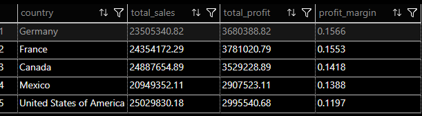
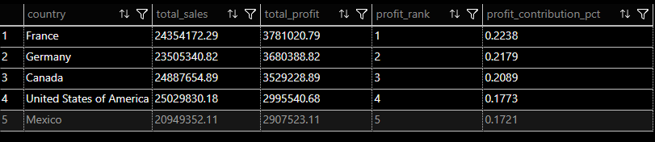

# 🌍 Performance Financeira por País

Esta pasta reúne análises focadas na **avaliação financeira por país**, permitindo comparar faturamento, lucro, margem e contribuição relativa.

## Análises disponíveis

### `country_by_country_financial_performance.sql`
Avalia a eficiência financeira de cada país, comparando:
- Vendas totais
- Lucro total
- Margem de lucro

Objetivo:
Identificar países mais eficientes financeiramente, não apenas os que vendem mais.

---

### `country_by_country_profit_ranking.sql`
Cria um ranking de países com base no lucro total, incluindo:
- Posição no ranking
- Percentual de contribuição no lucro global

Objetivo:
Priorizar mercados estratégicos com maior geração de valor.

---

## Resultado:
Screenshot do resultado da query, facilitando a visualização dos padrões identificados.

country_by_country_financial_performance

---

country_by_country_profit_ranking

