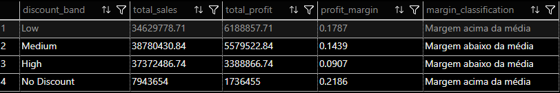

# 💸 Impacto dos Descontos

Esta pasta contém análises que avaliam como diferentes **faixas de desconto** afetam o desempenho financeiro do negócio.

## Análises disponíveis

### `discount_by_band_profit_analysis.sql`
Analisa o impacto das faixas de desconto sobre:
- Volume de vendas
- Lucro total
- Margem de lucro

A query também classifica cada faixa de desconto em relação à média geral de margem.

Objetivo:
Responder se descontos maiores realmente aumentam o lucro ou se estão corroendo a margem.

---

## Resultado:
Screenshot do resultado da query, facilitando a visualização dos padrões identificados.

