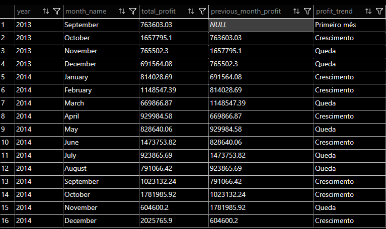

# 📈 Performance Financeira Temporal

Esta pasta concentra análises relacionadas à **evolução financeira ao longo do tempo**, com foco em lucro e tendência.

## Análises disponíveis

### `profit_monthly_trend.sql`
Avalia a evolução mensal do lucro, comparando cada mês com o anterior.

A análise classifica o comportamento do lucro como:
- Crescimento
- Queda
- Estável

Objetivo:
Identificar tendências financeiras e variações relevantes ao longo do tempo.

---

## Resultado:
Screenshot do resultado da query, facilitando a visualização dos padrões identificados.

