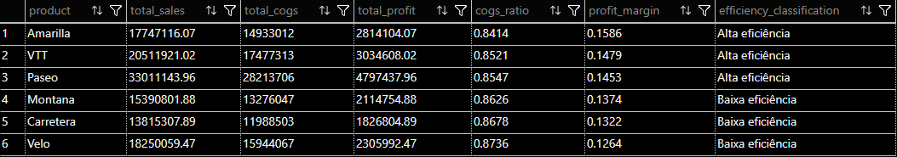

# ⚙️ Eficiência Operacional

Esta pasta reúne análises voltadas para a **eficiência operacional**, avaliando como custos impactam a rentabilidade.

## Análises disponíveis

### `product_by_product_operational_efficiency.sql`
Avalia a eficiência operacional por produto, relacionando:
- Custo (COGS)
- Vendas
- Lucro
- Margem de lucro

Os produtos são classificados com base na eficiência em relação à média do portfólio.

Objetivo:
Identificar produtos eficientes e aqueles onde o custo está corroendo a margem.

---

## Resultado:
Screenshot do resultado da query, facilitando a visualização dos padrões identificados.

