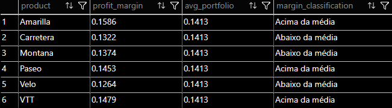

# 📦 Análise de Produtos

Esta pasta contém análises focadas na **rentabilidade dos produtos**, permitindo comparações diretas entre eles.

## Análises disponíveis

### `product_by_product_profit_margin.sql`
Calcula a margem de lucro por produto e compara cada um com a média geral do portfólio.

Os produtos são classificados como:
- Acima da média
- Na média
- Abaixo da média

Objetivo:
Avaliar a eficiência financeira individual dos produtos e apoiar decisões estratégicas.

---

## Resultado:
Screenshot do resultado da query, facilitando a visualização dos padrões identificados.

